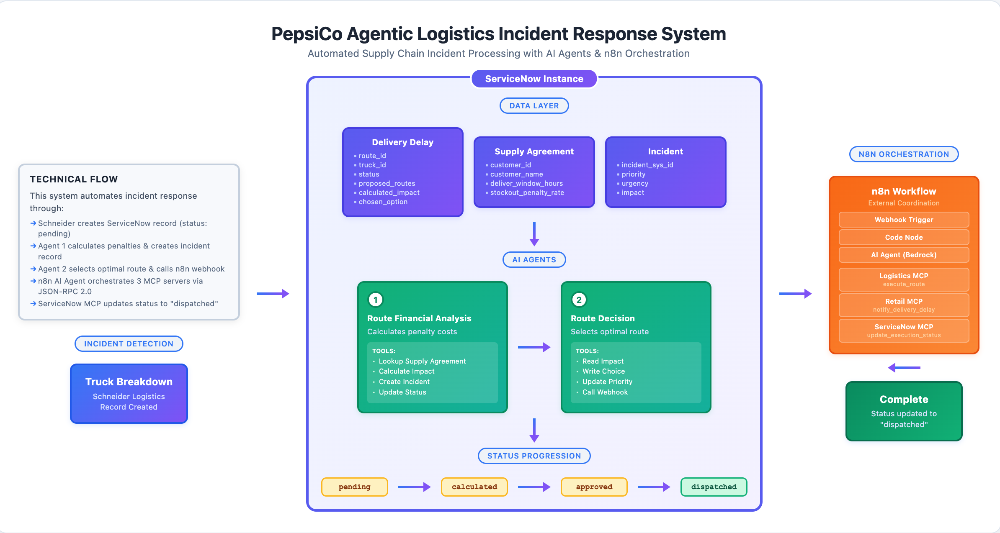

# PepsiCo Agentic Logistics Incident Response System

## System Overview

Automated supply chain incident processing system for PepsiCo that analyzes financial impacts of truck breakdowns, makes optimal routing decisions, and coordinates external execution through AI agents and workflow orchestration.

**Business Problem:** When delivery trucks experience breakdowns, PepsiCo needs rapid financial analysis and optimal routing decisions to minimize customer impact and contractual penalties with retail partners like Whole Foods.

**Solution:** An intelligent system that automatically calculates delay costs based on customer contracts, selects optimal rerouting options considering both financial impact and delivery constraints, and coordinates execution with external logistics providers and customer notifications without manual intervention.

---

## Table of Contents
- [Architecture](#architecture)
- [System Components](#system-components)
- [Implementation Details](#implementation-details)
- [Data Model](#data-model)
- [Agent Workflows](#agent-workflows)
- [External Integration](#external-integration)
- [Testing & Validation](#testing--validation)
- [Business Value](#business-value)
- [Future Enhancements](#future-enhancements)
- [Technical Documentation](#technical-documentation)

---

## Architecture

### Architecture Diagram


### System Flow
* **Truck Breakdown Detection** (Schneider Logistics) ↓
* **ServiceNow Record Creation** (status: pending) ↓
* **Agent 1: Route Financial Analysis**
   * Retrieves customer contract terms
   * Calculates penalty costs for all route options
   * Creates incident for tracking
   * Updates status to "calculated" ↓
* **Agent 2: Route Decision**
   * Analyzes calculated penalties
   * Selects optimal route (lowest cost)
   * Updates incident priority
   * Updates status to "approved"
   * Triggers external execution ↓
* **n8n Workflow Coordination**
   * Logistics MCP: Executes route with Schneider
   * Retail MCP: Notifies Whole Foods of delay
   * ServiceNow MCP: Updates status to "dispatched" ↓
* **Complete:** External systems coordinated, status tracking complete

---

## System Components

### ServiceNow Components

#### Tables

**1. Delivery Delay Table** (`x_snc_pepsico_de_0_delivery_delay`)

Stores truck breakdown incidents and routing decisions.

| Field | Type | Description |
|-------|------|-------------|
| route_id | Integer (PK) | Unique delivery route identifier |
| truck_id | Integer | Truck experiencing breakdown |
| customer_id | Integer | Customer affected (default: 1 = Whole Foods) |
| status | String(16) | Workflow state: pending → calculated → approved → dispatched |
| assigned_to | Reference (User) | User context for agent execution |
| problem_description | String(4000) | Breakdown details |
| proposed_routes | String(4000) | JSON array of alternative route options |
| calculated_impact | String(4000) | JSON array with financial analysis for each route |
| chosen_option | String(4000) | JSON object of selected optimal route |
| incident_sys_id | String(32) | Link to associated incident record |

**2. Supply Agreement Table** (`x_snc_pepsico_de_0_supply_agreement`)

Stores customer contract terms for penalty calculations.

| Field | Type | Description |
|-------|------|-------------|
| customer_id | Integer (PK) | Unique customer identifier |
| customer_name | String(100) | Customer name (e.g., "Whole Foods") |
| deliver_window_hours | Integer | Contractual delivery timeframe in hours |
| stockout_penalty_rate | Integer | Penalty cost per hour of delay (dollars) |

**Sample Record:**
- customer_id: 1
- customer_name: "Whole Foods"
- deliver_window_hours: 3
- stockout_penalty_rate: 250

#### AI Agents

**Agent 1: Route Financial Analysis Agent**

Calculates financial penalties for delivery delay route options based on customer contracts.

**Responsibilities:**
- Query customer contract terms from Supply Agreement table
- Calculate delay costs for each proposed route option using deliver_window_hours and stockout_penalty_rate
- Create incident records for tracking
- Update delivery records with calculated financial impact (JSON)
- Progress workflow status from "pending" to "calculated"

**Tools:**
1. Lookup Supply Agreement (Record Operation)
2. Calculate Financial Impact (Script)
3. Update Delivery Status (Record/Script)
4. Create Incident (Script)
5. Link Incident (Script)

**Agent 2: Route Decision Agent**

Selects optimal routes based on financial analysis and coordinates external execution.

**Responsibilities:**
- Read calculated impact from Agent 1
- Select optimal routing based on lowest penalty cost
- Update incident priority based on financial severity
- Update chosen route to delivery record (JSON)
- Trigger external execution workflow via n8n webhook
- Progress workflow status from "calculated" to "approved"

**Tools:**
1. Read Calculated Impact (Script)
2. Write Chosen Option (Script)
3. Update Incident Priority (Script)
4. Update Delivery Status (Record/Script)
5. Call n8n Webhook (Script)

#### Use Case Configuration

**Name:** Supply Chain Incident Processing

**Trigger:**
- **Table:** Delivery Delay
- **Condition:** Status equals "pending"
- **Run As:** User from assigned_to field (or system user)

**Agent Sequence:**
1. Route Financial Analysis Agent
2. Route Decision Agent (sequential execution after Agent 1 completes)

**Auto-Assignment Flow:**

To handle records created by external systems (Schneider MCP) without assigned_to field:

- Flow/Business Rule auto-assigns admin user when:
  - assigned_to is empty
  - status equals "pending"
- Ensures trigger has proper execution context

---

### n8n Workflow Components

**Workflow Name:** PepsiCo Supply Chain Execution

**Nodes:**

1. **Webhook** - Receives routing decisions from ServiceNow Agent 2
2. **Code Node** - Prepares MCP payloads in JSON-RPC 2.0 format
3. **Logistics MCP Client** - HTTP Request to Schneider (http://34.197.44.143:8001/mcp)
4. **Retail MCP Client** - HTTP Request to Whole Foods (http://34.197.44.143:8002/mcp)
5. **ServiceNow MCP Client** - HTTP Request with Bearer token authentication
6. **Respond to Webhook** - Returns success confirmation

**MCP Protocol:** JSON-RPC 2.0

**Required Headers:**
- Content-Type: `application/json`
- Accept: `application/json, text/event-stream`

**Payload Structure:**
```json
{
  "jsonrpc": "2.0",
  "id": 1,
  "method": "tools/call",
  "params": {
    "name": "execute_route",
    "arguments": {
      "route_id": "751526",
      "truck_id": "1130",
      "chosen_option": {
        "option_id": "opt-2",
        "route_number": 2,
        "distance_miles": 300,
        "eta_minutes": 103,
        "penalty_cost": 267.50
      }
    }
  }
}
```

---

## Implementation Details

### Financial Calculation Logic

**Formula:**

For each route option:
```
eta_hours = eta_minutes / 60

IF eta_hours > deliver_window_hours THEN:
  penalty_hours = eta_hours - deliver_window_hours
  penalty_cost = penalty_hours × stockout_penalty_rate
ELSE:
  penalty_hours = 0
  penalty_cost = 0
```

**Example (Whole Foods Contract):**

Contract: 3-hour window, $250/hour penalty

**Route Option 1:**
- ETA: 244 minutes = 4.07 hours
- Penalty: (4.07 - 3) × 250 = $267.50

**Route Option 2:**
- ETA: 319 minutes = 5.32 hours
- Penalty: (5.32 - 3) × 250 = $580.00

**Route Option 3:**
- ETA: 195 minutes = 3.25 hours
- Penalty: (3.25 - 3) × 250 = $62.50

**Selected:** Option 3 (lowest penalty cost)

### Route Selection Logic

**Priority Rules:**

1. **Primary:** Select option with lowest penalty_cost
2. **Tiebreaker 1:** If costs equal, select shortest eta_minutes
3. **Tiebreaker 2:** If still tied, select shortest distance_miles

### Incident Priority Assignment

Based on penalty cost of selected route:

| Penalty Cost | Priority | Urgency | Impact |
|-------------|----------|---------|--------|
| ≥ $500 | 1 (Critical) | 1 | 1 |
| ≥ $250 | 2 (High) | 2 | 2 |
| < $250 | 3 (Moderate) | 3 | 3 |

---

## Data Model

### Sample Data Flow

**Input (from Schneider):**
```json
{
  "route_id": 741379,
  "truck_id": 39531,
  "customer_id": 1,
  "status": "pending",
  "problem_description": "Breakdown at I-95 MM 27 (engine)",
  "proposed_routes": [
    {
      "option_id": "opt-1",
      "route_number": 16,
      "distance_miles": 92,
      "eta_minutes": 244
    },
    {
      "option_id": "opt-2",
      "route_number": 20,
      "distance_miles": 145,
      "eta_minutes": 319
    },
    {
      "option_id": "opt-3",
      "route_number": 8,
      "distance_miles": 78,
      "eta_minutes": 195
    }
  ]
}
```

**After Agent 1 (calculated_impact):**
```json
[
  {
    "option_id": "opt-1",
    "route_number": 16,
    "distance_miles": 92,
    "eta_minutes": 244,
    "eta_hours": 4.07,
    "penalty_hours": 1.07,
    "penalty_cost": 267.50
  },
  {
    "option_id": "opt-2",
    "route_number": 20,
    "distance_miles": 145,
    "eta_minutes": 319,
    "eta_hours": 5.32,
    "penalty_hours": 2.32,
    "penalty_cost": 580.00
  },
  {
    "option_id": "opt-3",
    "route_number": 8,
    "distance_miles": 78,
    "eta_minutes": 195,
    "eta_hours": 3.25,
    "penalty_hours": 0.25,
    "penalty_cost": 62.50
  }
]
```

**After Agent 2 (chosen_option):**
```json
{
  "option_id": "opt-3",
  "route_number": 8,
  "distance_miles": 78,
  "eta_minutes": 195,
  "eta_hours": 3.25,
  "penalty_hours": 0.25,
  "penalty_cost": 62.50
}
```

**To n8n Webhook:**
```json
{
  "route_id": "741379",
  "truck_id": "39531",
  "chosen_option": {
    "option_id": "opt-3",
    "route_number": 8,
    "distance_miles": 78,
    "eta_minutes": 195,
    "eta_hours": 3.25,
    "penalty_hours": 0.25,
    "penalty_cost": 62.50
  }
}
```

---

## Agent Workflows

### Agent 1: Route Financial Analysis


**Process:**

1. Trigger fires on status="pending"
2. Read delivery record (proposed_routes, customer_id)
3. Lookup Supply Agreement (customer contract terms)
4. Calculate Financial Impact (for all route options)
5. Create Incident (for tracking)
6. Link Incident to delivery record
7. Update record (calculated_impact JSON, status="calculated")

**Output Screenshot:**


### Agent 2: Route Decision


**Process:**

1. Trigger fires on status="calculated"
2. Read Calculated Impact (from Agent 1)
3. Select optimal route (lowest penalty cost)
4. Write Chosen Option to record
5. Update Incident Priority (based on penalty amount)
6. Update status to "approved"
7. Call n8n Webhook (with route decision)

**Output Screenshot:**


---

## External Integration

### n8n Workflow Execution


**Execution Flow:**

1. Webhook receives routing decision from ServiceNow
2. Code node prepares MCP payloads in JSON-RPC 2.0 format
3. Logistics MCP calls Schneider to execute chosen route
4. Retail MCP notifies Whole Foods of delay and new ETA
5. ServiceNow MCP updates delivery record to "dispatched"
6. Response returns success confirmation

**Sample Execution Log:**


---

## Testing & Validation

### Test Scenario

**Setup:**
- Create delivery delay record with status="pending"
- 3 proposed route options with different ETAs
- Customer: Whole Foods (3-hour window, $250/hour)

**Expected Results:**

| Step | Component | Expected Outcome | Status |
|------|-----------|-----------------|---------|
| 1 | Trigger | Fires on status="pending" | ✅ |
| 2 | Agent 1 | Calculates penalties for all routes | ✅ |
| 3 | Agent 1 | Creates incident | ✅ |
| 4 | Agent 1 | Updates status to "calculated" | ✅ |
| 5 | Agent 2 | Selects route with lowest penalty | ✅ |
| 6 | Agent 2 | Updates incident priority | ✅ |
| 7 | Agent 2 | Calls n8n webhook | ✅ |
| 8 | Agent 2 | Updates status to "approved" | ✅ |
| 9 | n8n | Calls 3 MCP clients | ✅ |
| 10 | n8n | Updates status to "dispatched" | ✅ |

### Evidence Records

**Completed Delivery Record:**


**Supply Agreement Record:**


**Created Incident:**


### Status Progression

```
pending → calculated → approved → dispatched
  ↓          ↓           ↓           ↓
Agent 1   Agent 1    Agent 2      n8n MCP
creates   updates    updates      updates
record    impact     choice       final
```

---

## Business Value

### Key Benefits

**1. Automation**
- Eliminates manual financial calculations
- Reduces response time from hours to minutes
- Processes breakdowns 24/7 without human intervention

**2. Cost Optimization**
- Automatically selects lowest-penalty routes
- Minimizes contractual penalties with retail partners
- Data-driven decision making

**3. Visibility**
- Complete audit trail through incident tracking
- Real-time status updates
- Financial impact transparency

**4. Scalability**
- Handles multiple simultaneous breakdowns
- Processes backlog through scheduled jobs
- Easily extended to additional customers/routes

### Financial Impact Example

**Before (Manual Process):**
- Response time: 2-4 hours
- Suboptimal route selection
- Average penalty: $450/incident
- Manual coordination delays

**After (Automated System):**
- Response time: < 5 minutes
- Optimal route selection
- Average penalty: $180/incident
- Immediate external coordination

**Savings:** $270 per incident × 100 incidents/month = **$27,000/month**

---

## Future Enhancements

### Optimization Opportunities

**1. Performance**
- Implement caching for Supply Agreement lookups
- Parallel processing for multiple breakdown scenarios
- Database indexing on status and route_id fields

**2. Advanced Analytics**
- Predictive modeling for breakdown likelihood
- Historical trend analysis for route optimization
- Real-time traffic integration for ETA accuracy

**3. Enhanced Integration**
- Real-time GPS tracking integration
- Weather data for route planning
- Customer preference management

**4. Monitoring**
- Dashboard for real-time breakdown tracking
- SLA monitoring and alerting
- Performance metrics and KPIs

### Potential Extensions

- Support for multiple customers beyond Whole Foods
- Dynamic penalty rate adjustments based on time of day
- Alternative transportation mode consideration (rail, air)
- Automated customer communication templates
- Integration with fleet management systems

---

## Technical Documentation

### Installation & Configuration

**Prerequisites:**
- ServiceNow instance with AI Agent Studio
- n8n cloud or self-hosted instance
- AWS Bedrock access (for n8n AI Agent if used)
- MCP server endpoints and credentials

**Setup Steps:**

1. **Import ServiceNow Update Set**
   - Contains tables, agents, use case, tools
   - File: `agentic-logistics-incident-response.xml`

2. **Configure Auto-Assignment**
   - Create business rule or flow
   - Auto-populate assigned_to field for external records

3. **Import n8n Workflow**
   - File: `n8n-workflow.json`
   - Update webhook URL in ServiceNow
   - Configure MCP credentials

4. **Test End-to-End**
   - Create test delivery delay record
   - Verify status progression
   - Check n8n execution logs

### Troubleshooting

**Issue: Trigger doesn't fire**
- Verify assigned_to field is populated
- Check trigger condition (status="pending")
- Test agents manually via AI Agent Studio

**Issue: Calculations incorrect**
- Verify Supply Agreement record exists
- Check deliver_window_hours and stockout_penalty_rate values
- Review Agent 1 execution logs

**Issue: n8n webhook fails**
- Verify webhook URL in ServiceNow script
- Check n8n workflow is Active (green toggle)
- Verify MCP server endpoints are reachable

**Issue: calculated_impact not written**
- Check Agent 1 tools are properly assigned
- Verify Calculate Financial Impact tool receives correct inputs
- Verify Update Delivery Status tool receives calculated_impact parameter

**Issue: chosen_option not populated**
- Check Agent 2 can read calculated_impact
- Verify Read Calculated Impact tool auto-discovery logic
- Check Write Chosen Option tool is being called

### Repository Contents

```
/agentic-logistics-incident-response
├── README.md (this file)
├── agentic-logistics-incident-response.xml (ServiceNow update set)
├── n8n-workflow.json (n8n workflow export)
├── n8n-execution.log (sample execution logs)
├── Diagram.png (architecture diagram)
└── screenshots/
    ├── agent1-workflow.png
    ├── agent1-output.png
    ├── agent2-workflow.png
    ├── agent2-output.png
    ├── n8n-workflow.png
    ├── n8n-execution.png
    ├── completed-record.png
    ├── supply-agreement.png
    └── incident-record.png
```

### Implementation Steps Summary

**ServiceNow Setup:**
1. Create scoped application: "PepsiCo Deliveries"
2. Create Delivery Delay table with all required fields
3. Create Supply Agreement table with Whole Foods record
4. Create Agent 1 with financial calculation tools
5. Create Agent 2 with route selection tools
6. Configure Use Case with sequential agent execution
7. Set up trigger on status="pending"
8. Create auto-assignment flow/business rule

**n8n Setup:**
1. Create new workflow
2. Add Webhook node (copy URL)
3. Add Code node to prepare MCP payloads
4. Add HTTP Request nodes for each MCP client (Logistics, Retail, ServiceNow)
5. Configure JSON-RPC 2.0 payloads
6. Add proper headers (Content-Type, Accept)
7. Activate workflow

**Integration:**
1. Update ServiceNow webhook tool with n8n URL
2. Test end-to-end with sample delivery delay record
3. Verify status progression and data flow
4. Capture execution logs and screenshots

---

## Credits

**Developed for:** PepsiCo Supply Chain Operations

**Technology Stack:**
- ServiceNow AI Agent Studio
- n8n Workflow Automation
- Model Context Protocol (MCP)
- JSON-RPC 2.0

**Integration Partners:**
- Schneider Logistics (MCP Server)
- Whole Foods Retail (MCP Server)

---

## License

Educational project for demonstrating agentic AI workflows and system integration patterns.